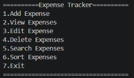
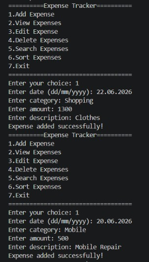
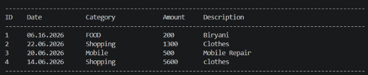
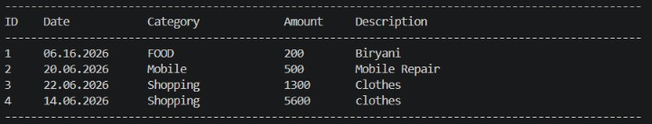

# 💰 Expense Tracker in C

A menu-driven Expense Tracker application developed using **C Programming**. This project allows users to manage and organize expenses efficiently while demonstrating fundamental programming concepts such as structures, file handling, searching, sorting, and CRUD operations.

---

## ✨ Features

* ➕ Add Expenses
* 📋 View Expenses in Tabular Format
* ✏️ Edit Existing Expenses
* 🗑️ Delete Expenses
* 🔍 Search Expenses by Category
* 📊 Sort Expenses by Amount
* 💾 File Handling for Persistent Storage
* 📁 Automatic Data Loading from File

---

## 🛠️ Technologies Used

* C Programming
* Structures
* Arrays
* Functions
* File Handling
* String Manipulation
* Searching Algorithms
* Sorting Algorithms

---

## 📸 Screenshots

### Main Menu



### Add Expense



### View Expenses



### Sorted Expenses



---

## 📂 Project Structure

```text
Expense_Tracker/
│
├── expense.c
├── expenses.txt
├── README.md
├── .gitignore
└── Screenshots/
```

---

## ▶️ How to Run

Compile:

```bash
gcc expense.c -o expense
```

Run:

```bash
./expense
```

---

## 🎯 Key Learning Outcomes

Through this project, I gained practical experience in:

* Designing menu-driven applications
* Working with structures and arrays
* Performing file operations
* Implementing search and sort functionality
* Organizing programs using functions
* Managing data persistence

---

## 🚀 Future Enhancements

* Income Tracking
* Expense Analytics
* Budget Management
* Monthly Reports
* PIN Authentication
* GUI Version using GTK
* Web-based Version using HTML, CSS and JavaScript

---

## 👩‍💻 Author

**Nanditha**

Computer Science Engineering Student
